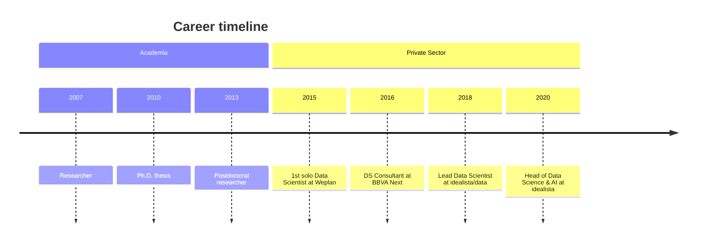

I lead Data and AI strategy at [idealista](https://www.idealista.com), Southern Europe's largest real estate marketplace, where my team has shipped 90+ AI projects across automated valuation, search ranking, fraud detection, and content moderation. My work sits at the intersection of applied machine learning, spatial data science, and the messy reality of making AI useful inside a product organization.

Before idealista, I built recommender systems and loyalty models reaching 7 million customers as a consultant working rat BBVA Next Technologies for different companies. I hold a Ph.D. in Economics from the University of Oviedo, with 7 peer-reviewed publications. I've given 20+ talks at venues including Banco de España, Carto Conference, and Instituto Tramontana, and I teach AI and data science as adjunct faculty at [IE University](https://www.ie.edu/school-science-technology/) and [The Valley](https://thevalley.es/).

I believe AI succeeds when it amplifies domain expertise rather than replacing it, and that most data science teams fail by chasing technical sophistication instead of business impact. That conviction shapes how I build teams, choose projects, and teach.

When I'm not thinking about models and organizations, I shoot analog photography and read about creative processes and philosophy.

## Teaching & Speaking

- Adjunct Faculty, [IE School of Science and Technology](https://www.ie.edu/school-science-technology/) (Master in Business Analytics & Data Science)
- Professor, [The Valley Digital Business School](https://thevalley.es/) (AI and applied ML)
- External instructor, [Instituto Tramontana](https://www.tramontana.net/direccion-producto) (Product Management program)
- [[mocs/moc-public-appearances|Public speaking]]: 20+ talks and podcast appearances

## Selected Publications

- Rey-Blanco, D., Arbués, P., López, F. A., & Páez, A. (2024). Machine learning for spatial market segmentation. *Environment and Planning B*, 51(1), 89-108.
- Kenyon, G.E., Arribas-Bel, D., Robinson, C., et al. (2024). Intra-urban house prices in Madrid. *npj Urban Sustainability*, 4(1), 26.
- [[mocs/moc-research|Full publication list]]

## Let's Connect

I write about management, data science, and AI on [[mocs/digital-garden|my blog]]. To see what I'm working on right now, check [[mocs/now|my /now page]]. If you'd like to talk, grab a slot during [[notes/Office hours|office hours]].
