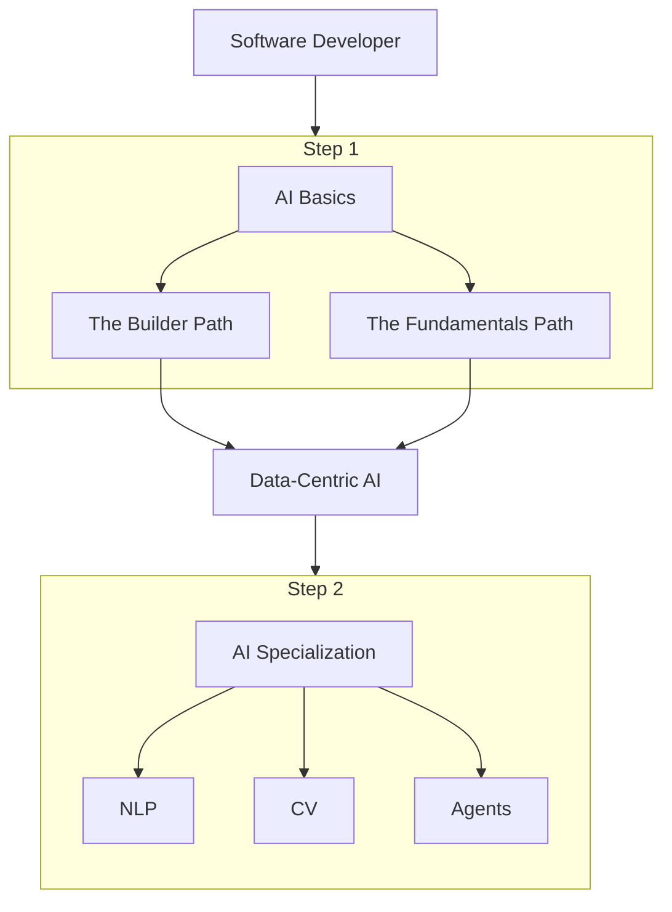

You’re a software engineer who finds AI exciting, and you’re eager to start building AI-powered applications, but maybe you aren’t looking to switch careers entirely into Data Science or Machine learning. You’re definitely not alone. After publishing my previous post, [Why Software Engineers Should Learn a Bit of Data Science](notes/Why%20Software%20Engineers%20Should%20Learn%20a%20Bit%20of%20Data%20Science.md), I received many questions from developers who wanted guidance on how to learn AI practically, without completely reshaping their professional path.

Instead of answering the same questions repeatedly, I decided to create this guide. Here you’ll find curated learning paths tailored specifically for software engineers, depending on how deep you want to dive and what learning style suits you best.

>[!warning]
> If you're aiming for a full career change, check out [Data Science Fundamentals](notes/Data%20Science%20Fundamentals.md), covering core concepts every aspiring Data Scientist should know.

# AI learning paths Guide

This guide is a friendly follow-up to help you start with AI on **your** terms. We'll explore two learning paths tailored to your learning style.

Before diving in, here's a visual map of these paths:

Step 1 and the Data Centric lessons are essential. Step 2 is for those ready to dive deeper or involved in hands-on projects needing advanced solutions.

## **STEP 1.  The basics**
### **Path 1: The Builder Path** 

**Who this is for:** Developers who learn best by building and want quick, tangible results. Ideal if you prefer hands-on AI learning.

**Recommended Course:** [Practical Deep Learning for Coders](https://course.fast.ai/) by Fast.ai, a famous course created by Jeremy Howard and team. This course starts you off by coding real models from day one. You’ll use high-level libraries (Fastai on top of PyTorch) to train neural networks on real datasets. They use a [**top-down approach**](https://www.fast.ai/posts/2016-10-08-teaching-philosophy.html) starting with complete, useful solutions to real-world problems and gradually working down to foundational concepts.
- **Key Topics Covered:** GPUs setup, image classification with transfer learning, CNNs, overfitting, NLP with text classification, RNNs, embeddings, recommendation systems. Part 2 of the course focuses in recent advancements such as Stable Diffusion, Transformers architecture and goes deeper in fundamental concepts such as Backpropagation, Autoencoders and helpful techniques such as inizialization/normalization. 
- **Time Commitment:** Around 7–8 weeks (Part 1: 9 lessons, ~1.5 hours each, plus ~10 hours/week practice). Part 2 (~30 hours of videos) may take about 16 weeks.
    
### **Path 2: The Fundamentals Path**  

**Who this is for:** Engineers who prefer a solid theoretical foundation and want to understand _why_ behind the _how_ Andrew Ng's reassuring style offers practical engineering advice and deeper insights, equipping you with the vocabulary and mental models to converse confidently about AI.

**Recommended Courses:** I highly recommend Andrew Ng’s content on Coursera for a solid foundation. In particular, follow the sequence: Machine Learning Specialization and then Deep Learning Specialization:
- [Machine Learning Specialization at DeepLearning.AI](https://www.deeplearning.ai/courses/machine-learning-specialization/): This is an updated, beginner-friendly take on Andrew Ng’s classic ML course. I first took the course in 2014 and back then the course was taught in Octave. Don´t be afraid, the current version relies on python.
    - _Key Topics:_ Supervised learning algorithms like linear regression and logistic regression; neural network basics; decision trees and tree ensembles such as random forests and XGBoost); basic unsupervised learning like k-means clustering and anomaly detection; recommender systems; and importantly, best practices for building and evaluating models: train/test splits, avoiding overfitting, etc..
    - _Estimated Time:_ ~8-10 weeks (the specialization is designed to be ~2.5 months at ~5 hours/week). It’s fairly gentle on the math (uses an “intuitive first, optional math later” approach), but you will get to see the underlying equations and even derive a few simple ones. Great for cementing your understanding.
- [Deep Learning Specialization at DeepLearning.AI](https://www.deeplearning.ai/courses/deep-learning-specialization/): After the ML basics, this 5-course series goes deep into neural networks. It’s also taught by Andrew Ng and team.
    - _Key Topics:_ Neural network foundations; optimization techniques; practical tricks to improve models; convolutional neural networks for computer vision; sequence models including RNNs, LSTMs, and even a bit on transformers for natural language processing. 
    - _Estimated Time:_ ~3 months (designed as ~12 weeks at 8-10 hours/week). This is a bit more intensive, but by the end you’ll have a solid grasp of deep learning’s core ideas and how to implement them.

>[!tip]
> The Machine Learning Specialization starts very gently. You don’t need advanced math, just comfort with basic coding. By the time you finish the Deep Learning Specialization, you’ll have touched on classic ML and many of the hottest topics in AI. It’s a worthwhile journey.

## **Interlude: Data-Centric AI**

Initially, you’ve learned the basics of how models work, usually with a fixed dataset, improving the model itself. In real-world scenarios, you typically fix the model and iterate on the data instead.

- Data-Centric AI: Often, curating your data can significantly enhance AI model performance. 
	- _Recommended Courses:_ [Introduction to Data-Centric AI](https://dcai.csail.mit.edu/) by MIT. 
	- _Key Topics:_ Handling messy data, data curation, class imbalance, data augmentation and labeling errors.

## **STEP 2.  The Specialization Dive**

**Who this is for:** Those who’ve caught the AI bug and want to **go further** by focusing on a particular domain. Once you have covered the basics, you can branch out into a specialization that excites you: be it Computer Vision, natural language/LLMs, or the emerging world of AI agents (_“agentic workflows”_). This path is more open-ended and can be tailored to _your_ interests, you might even want to go for robotics, industrial or medical applications.

- **Computer Vision (CV) Specialization:** Build AI that "sees," classify images, detect objects.
    - _Recommended Courses:_ Consider the [Advanced Computer Vision with TensorFlow](https://www.coursera.org/learn/advanced-computer-vision-with-tensorflow) or if you prefer Pytorch you may want to check [Computer Vision Nanodegree](https://www.udacity.com/course/computer-vision-nanodegree--nd891?promo=MEMORIAL50&coupon=MEMORIAL50&gad_campaignid=20960322867&gbraid=0AAAAADmkdSRzRmMbyugVswS8pmRIyy3Ur) at Udacity.
    - _Key Topics:_ CNNs, object detection (YOLO, Faster R-CNN), segmentation, vision transformers

- **Natural Language Processing (NLP):** Maybe you’re intrigued by how ChatGPT works, or you want to build a smart chatbot or text analysis tool. Specializing in NLP/LLMs will let you build AI that **understands and generates language**.
    - _Recommended Courses:_ A solid option is the [Natural Language Processing Specialization](https://www.deeplearning.ai/courses/natural-language-processing-specialization/), which covers everything from classic NLP techniques to transformer models. Additionally, the [LLM Course](https://huggingface.co/learn/llm-course/chapter1/1) is an excellent hands-on resource to learn how to use modern large language models. If you need to improve your prompting techniques, you may not need a full course, just reading a paper like [this one](https://arxiv.org/abs/2402.07927) could go a long way.
    - _Key Topics:_ Text preprocessing, embeddings, sequence models, transformers (BERT/GPT), Name Entity Recognition.
    
- **Agentic AI and Workflow Automation:** This is a newer, cutting-edge area: building [AI Agents](notes/Agents%20explained.md) that can make decisions, use tools, and perform multi-step tasks autonomously. Sometimes called _agentic workflows_, it’s about chaining AI systems together or with external tools so they can solve complex problems with minimal human intervention. 
    - _Recommended Resources:_ A great starting point is exploring the [AI Agents Course](https://huggingface.co/learn/agents-course/unit0/introduction) by Hugging Face which will show you smol-agents, LangChain and Langraph frameworks. You may also want check materials like the [A pratical guide to building agents by OpenAI](https://cdn.openai.com/business-guides-and-resources/a-practical-guide-to-building-agents.pdf) and [Building Effective AI Agents](https://www.anthropic.com/engineering/building-effective-agents) by Anthropic.
    - _Key Concepts:_ ReAct (Reasoning and Acting) pattern, using tools via AI, memory and context management for agents, and orchestrating multiple agents, evaluation of [LLM based products](https://hamel.dev/blog/posts/evals/) and [agentic workflows](https://hamel.dev/blog/posts/field-guide/). 

# **Final Thoughts**

Learning AI as a software engineer is **absolutely doable** and can be hugely rewarding. The key is to choose a path that matches your goals and learning style. Maybe you start with the Builder Path to build confidence with a cool project, then later circle back to do the Fundamentals Path for deeper understanding. Or perhaps you do the fundamentals first, then jump straight into a specialization that aligns with your work. There’s no one-size-fits-all, and that’s the beauty of learning.

What’s important is that you **start**. Even a small step into AI will pay off: you’ll be able to prototype smarter features, better communicate with data scientists, ML Engineers and [AI Product Managers](notes/Explaining%20AI-infused%20products.md), and overall be a more versatile engineer in this AI-driven era. And remember, you don’t have to become an AI researcher to reap the benefits, a _little_ AI knowledge goes a long way in building better software.