What if you could 10x your effectiveness as a manager, not by working more hours, but by offloading the cognitive overhead to a machine?

Every morning I sit down at my terminal and ask Claude Code what my day looks like. It pulls my tasks, my calendar, my meeting history, and tells me what matters. Two years ago I was handwriting my schedule and tasks in a notebook.

But let me back up.

## The Weight of the Ladder

The cognitive load when you [climb the ladder](notes/Time%20to%20manage.md) never stops growing. I manage cross-functional AI initiatives including strategic decisions, training programs, and [change management](notes/Change%20Resistance%20as%20a%20Corporate%20Autoimmune%20Disease.md). Beyond that, I supervise [AI projects](notes/Agents%20explained.md), [direct reports](notes/Pride%20of%20my%20team.md), and field constant [requests and consultations](notes/Other%20People%20Problems.md) from [business managers, tech leaders, and all kinds of stakeholders](notes/Internal%20Networking.md).

That is a heavy burden. You need to think strategically while simultaneously dealing with human problems, navigating corporate politics, and making sure your direct reports are thriving, [growing](notes/Growth%20mindset.md), executing, and delivering with minimum friction.

>[!tip] Idea
> Lots of people talk about 10x engineers. I started wondering: what would a 10x manager even look like?

At this level you need to be really organized. You cannot lose sight of the big picture but you also need to keep an eye on details and anticipate problems ahead. I have always relied on [writing in all kinds of forms](notes/Write%20well%20to%20solve%20problems.md): long pieces, project notes, meeting notes, and one-on-ones. And more importantly, you have to process all this information efficiently without being overwhelmed.

## The Iron Age

A couple of years ago I wrote about how I managed [my tasks and my teams'](notes/How%20I%20Manage%20Myself%20and%20My%20Team%20Using%20Obsidian%20Tasks.md), [my second brain](notes/My%20workflow%20for%20my%20public%20second%20brain.md) and [my management duties](notes/Energy%20Management%20Confession.md) using Obsidian. I relied on a heavy manual process, [somewhat automated](notes/AI%20Enhanced%20Knowledge%20Management.md), but still with lots of manual work.

For each meeting I took notes by hand. And by hand I mean writing on paper. Taking notes directly on the computer has always been distracting for me, so I would write them down in my notebook and then transfer them to the computer. At first by typing, and once large vision models arrived in ChatGPT, I started taking pictures and asking the model to transcribe them.

OCR models had worked for a while, but they always struggled with my handwriting. They didn't understand context and couldn't self-correct based on that information.

I remember being amazed when GPT got vision capabilities and I could do the whole process on my smartphone. Open ChatGPT, upload the images, and my terrible handwriting was understood, corrected, and ready to be copied and pasted from the ChatGPT session on my laptop. Mostly great.

From my current perspective, that felt like the Iron Age.

## Living in the Terminal

Right now I live in my terminal with Claude Code as my personal assistant. It reviews my daily note where I have all the pending tasks, things due in projects, and work I need to follow up from my team or others. I classify all my tasks by importance and set a due date.

Claude wrote a simple Python script to read my calendar too, so it has a clear picture of my day ahead. Every time I ask about my day, a Claude skill kicks in. It retrieves tasks directly from Obsidian, runs the meetings script, and enriches them with all the related information, including past meetings and related notes. It provides a clear view with lots of [context](notes/Context%20Engineering.md).

Depending on my schedule, I might have to attend a meeting. Before a one-on-one, I ask Claude to prepare me. A meeting preparation skill reads the last three or four meetings with that person, identifies patterns, surfaces [pending tasks](notes/DRI.md) from [both sides](notes/Different%20managerial%20styles.md), and suggests what to discuss. I walk in already knowing what matters. For project meetings, it pulls the project context, checks progress against commitments, and flags blockers.

I can jump in with the related tasks and past information, fully prepared and ready to get the most out of sync time with other people. With AI-powered transcription, I can focus on the conversation, read the room, and be sharper. I still jot down the occasional idea or concern on paper for later processing, but the machine does all the heavy lifting.

At the end of the day, I send the transcriptions to the terminal. Another Claude skill loads the data, writes notes, and extracts tasks with the person responsible. It automatically opens a new tab in Obsidian, where I review the notes and triage the tasks. Often it creates actions for others that I don't need to supervise, so I delete those and prioritize the rest by importance and due date.

```mermaid
flowchart TD
    subgraph DAILY["Daily Preparation"]
        DWM["Daily Work Skill"]
        DWM --> TASKS["2 tasks due today"]
        DWM --> CAL["3 meetings scheduled"]
    end

    CAL --> MARIA & SYNC
    TASKS --> DEEP

    subgraph MARIA["1:1 with Maria"]
        M_PREP["Prep Skill"]
        M_PREP --> M_CTX["Last 3 meetings<br/>Pending tasks<br/>Growth themes"]
        M_CTX --> M_MEET["1:1 Transcription"]
        M_MEET --> M_POST["Post-Meeting Skill"]
        M_POST --> M_OUT["Notes + 2 new tasks"]
    end

    subgraph SYNC["Data Leadership Sync"]
        S_PREP["Project Prep Skill"]
        S_PREP --> S_CTX["Project status<br/>Blockers<br/>Commitments"]
        S_CTX --> S_MEET["Meeting Transcription"]
        S_MEET --> S_POST["Post-Meeting Skill"]
        S_POST --> S_OUT["Notes + 4 new tasks"]
    end

    subgraph DEEP["Draft ML Governance"]
        D_RES["Research Skill"]
        D_RES --> D_CTX["Related notes<br/>Literature<br/>Past decisions"]
        D_CTX --> D_ADV["Advisor Skills"]
        D_ADV --> D_OUT["CDO + CTO critique<br/>Refined draft"]
    end

    classDef skill fill:#4ECDC4,stroke:#333,stroke-width:2px,color:#1a1a1a
    class DWM,M_PREP,M_POST,S_PREP,S_POST,D_RES,D_ADV skill
```

When I have a few minutes, I tackle the easy tasks or go deep mode to solve a harder problem. When I need to think deeply about a topic, I can ask Claude to research my own vault. The research skill finds relevant notes across years of captures, [literature notes](./literature-notes/), and my [own writing](./notes/), then synthesizes them into a research note with proper links. Useful when writing or preparing for strategic discussions. I have even built Chief Data Officer, CPO, CTO, AI Engineer, and Data Architect skills that critique my ideas in rounds.

Compare this to my old approach in [[How I Manage Myself and My Team Using Obsidian Tasks]]: I had the Eisenhower matrix, but I still had to manually check my calendar, mentally prepare for meetings, and figure out how to fit everything together.

Now the cognitive load of "planning the day" takes 5 minutes instead of 30 minutes.

## The Weekly Rhythm

By the end of the week everyone on my team writes a few notes to update the status of projects or share with our closest teams any action in terms of [glue work](notes/Glue%20work.md). By Friday I have all the meetings transcribed, new tasks created, and completed ones marked off.

Then I call the "wrap my week up" skill. It has all the information about what I have been doing. I share what's worth sharing publicly with the rest of the company, and review what I have achieved during the past days. The skill also looks at my following week, relating what's ahead to what's ending, while informing me of the next important tasks I should focus on.

The weekly skill also generates a reading wrap-up using one of [the very first personal code projects I vibe coded](notes/Building%20a%20Semi-Automated%20Link%20Blog%20for%20Weekly%20Reads.md). It scans the articles I've captured during the week, summarizes each, and creates a digest organized by topic. I can see at a glance what I've been learning about AI, management, or whatever caught my attention.

## The Payoff

I have transitioned from a heavy manual process to a highly automated one that [keeps me in the loop](mocs/ai.md) to make the decisions. This lets me focus on what matters and direct my attention to the hard parts, which are usually related to people or organizational issues.

After working with this system for some weeks, I feel like I can manage much more information, be more present and mindful, and do my job better than before. Personal assistants existed for a reason, but in modern companies, especially in the tech sector, few people still rely on them to help prepare their day and filter signal from noise.

Of course it's not a perfect system. Sometimes Claude hallucinates tasks that don't exist or misunderstands the tone of a meeting. I still have to review everything. And I gave up some spontaneity: there's discipline required to keep the system fed with good input.

## The 10x Manager

Lots of people talk about 10x engineers, those mythical developers who produce ten times more than their peers. But I've started thinking about something different: the 10x manager.

Not someone who attends ten times more meetings or sends ten times more emails. That's a recipe for burnout. Doing more does not mean being more effective. I mean someone who can more context, spot patterns across more information, and still show up present and focused for the conversations that actually matter: the ones about people, strategy, and the hard organizational problems no AI can solve. 

[Andy Grove called it](notes/Essential%20Books%20for%20New%20Managers%20in%20Tech.md): your output as a manager is measured by the output of your team, multiplied by your impact on it. AI doesn't replace that equation. It amplifies it.

But here's what I'm still figuring out: where's the line?

I still plan ahead, manage problems, remove blockages, and design solutions while supporting the organization to grow. My actual job hasn't changed. But now I can make better decisions because I have a clearer head and more bandwidth for the parts that require a human. The problem is, with all this leverage, it's tempting to take on more, to expand my scope, to do everything because I *can*.

That's the trap. The same tools that make you more effective can push you to overreach. You start thinking you can handle more projects, more people, more problems. And maybe you can, for a while. But the leverage cuts both ways: it can multiply your impact or multiply your burnout.

So I'm trying to be intentional. Not about doing more, but about doing what matters. The AI handles the overhead. I focus on the decisions only I can make.